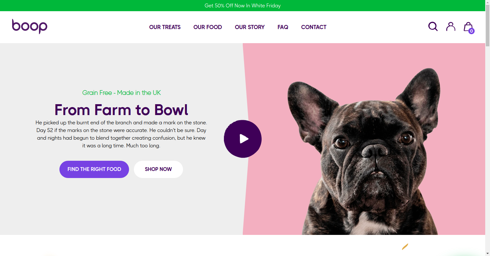
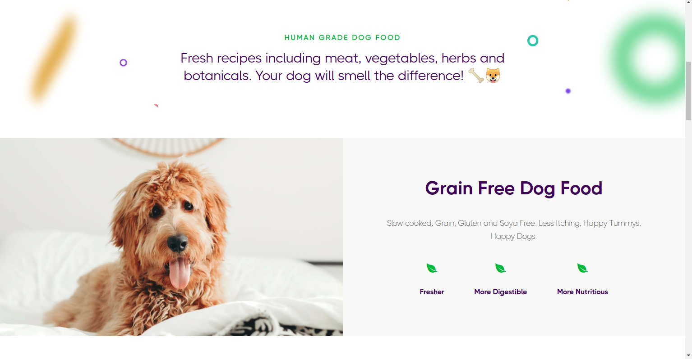
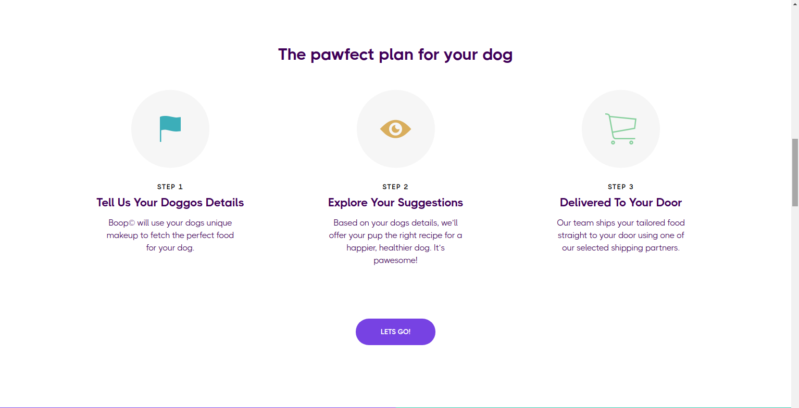
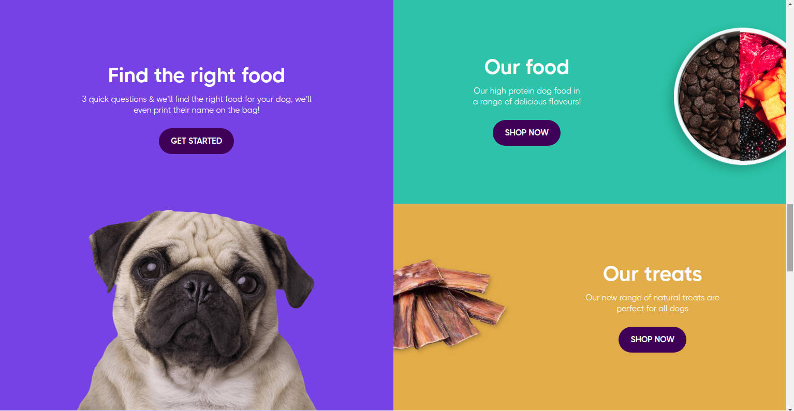
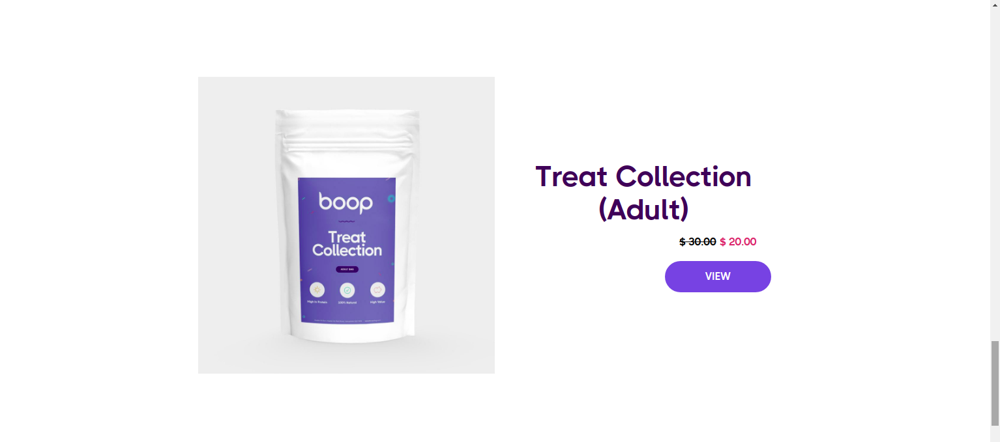
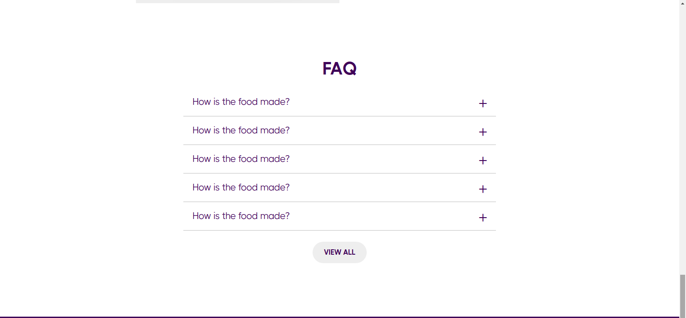
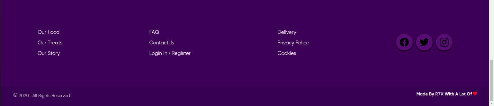
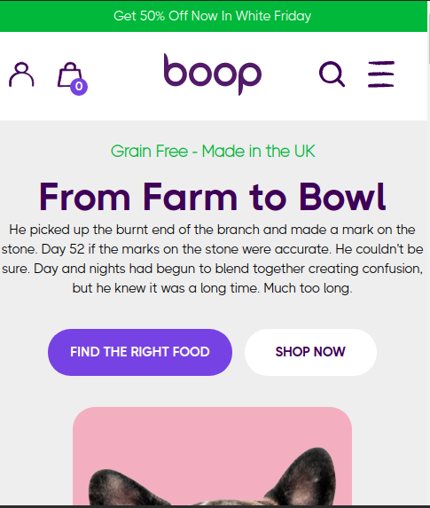

# Description
1. - [x]  Boop template created just by Html5 and Css3.
1. - [x]  It inspired from https://boopdoggy.com, So all rights reserved to him.
1. - [x]  I used the flex layout in all parts of template
1. - [x]  It is responsive design (Media Queries) basic to content view.
1. - [x]  Css3 animation.
1. - [x]  Ionicons & SVG images.
1. Because we respect the rights, So in futur it will not get updates. **But I will work on another independent projects**
  1. - [ ] No vendor prefixes for Css3 style (NU).
  1. - [ ] Not support all browsers (NU).

## Preview Template

### In desktop preview

### In mobile preview

1. [Part 2](preview_pic/mobile3.png)
1. [Part 3](preview_pic/mobile4.png)
1. [Part 4](preview_pic/mobile5.png)
1. [Part 5](preview_pic/mobile6.png)
1. [Part 6](preview_pic/mobile7.png)
1. [Part 7](preview_pic/mobile8.png)
1. [Part 8](preview_pic/mobile9.png)
1. [Part 9](preview_pic/mobile10.png)
1. [Part 10](preview_pic/mobile11.png)
